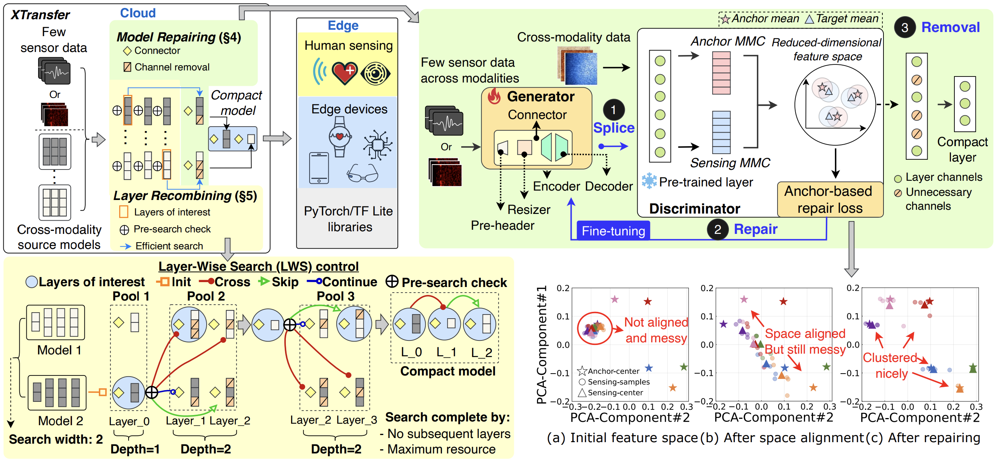

<div align="center">   

# XTransfer: Cross-Modality Model Transfer for Human Sensing with Few Data at the Edge
</div>

<div align="center">   

[](http://arxiv.org/abs/2506.22726) 
[](LICENSE) 
[]()

</div>

This is the official repository of the **XTransfer**, a pioneering and scalable method that enables resource-efficient, modality-agnostic model transfer for advancing human sensing edge systems with few data (under review). 

**XTransfer: Cross-Modality Model Transfer for Human Sensing with Few Data at the Edge**
<br/>
[Yu Zhang<sup>1</sup>](https://yuzhang.dev/), [Xi Zhang<sup>1</sup>](), [Hualin Zhou<sup>1</sup>](), [Xinyuan Chen<sup>1</sup>](), [Shang Gao<sup>1</sup>](), [Hong Jia<sup>3</sup>](https://h-jia.github.io/), [Jianfei Yang<sup>2</sup>](https://marsyang.site/), [Yuankai Qi<sup>1</sup>](https://v3alab.github.io/author/yuankai-qi/), [Tao Gu<sup>1</sup>](https://taogu.site/)
<br/>
<br/>
<sup>1</sup>Macquarie University, <sup>2</sup>Nanyang Technological University, <sup>3</sup>The University of Melbourne
<br/>


## 🔥 News
- [2025-06-28] Our preprint paper is available on 👉[arXiv](http://arxiv.org/abs/2506.22726).
  

## 🔗 Citation
If you find our work helpful to your research, please consider citing:


```shell
@article{Yu_2025,
  title={XTransfer: Cross-Modality Model Transfer for Human Sensing with Few Data at the Edge},
  author={Yu Zhang and Xi Zhang and Hualin Zhou and Xinyuan Chen and Shang Gao and Hong Jia and Jianfei Yang and Yuankai Qi and Tao Gu},
  eprint={2506.22726},
  archivePrefix={arXiv},
  year={2025}
}
```
## 📝 Abstract 

Deep learning for human sensing on edge systems offers significant opportunities for smart applications. However, its training and development are hindered by the limited availability of sensor data and resource constraints of edge systems. Current methods that rely on transferring pre-trained models often encounter issues such as modality shift and high resource demands, resulting in substantial accuracy loss, resource overhead, and poor adaptability across different sensing applications. In this paper, we propose XTransfer, a first-of-its-kind method for resource-efficient, modality-agnostic model transfer. XTransfer freely leverages single or multiple pre-trained models and transfers knowledge across different modalities by (i) model repairing that safely repairs modality shift in pre-trained model layers with only few sensor data, and (ii) layer recombining that efficiently searches and recombines layers of interest from source models in a layer-wise manner to create compact models. We benchmark various baselines across diverse human sensing datasets spanning different modalities. Comprehensive results demonstrate that XTransfer achieves state-of-the-art performance on human sensing tasks while significantly reducing the costs of sensor data collection, model training, and edge deployment.

## 📦 Method
|  | 
|:--:| 
| <div align="left">***Figure 1. Overall pipeline of XTransfer**. Once few sensing data and pre-trained source models are ready, Layer-Wise Search (LWS) control segments source models into layers and uses the pre-search check to decide if repairing is needed. Splice-Repair-Removal (SRR) pipeline then fine-tunes connectors to repair selected layers. Finally, LWS control selects and recombines layers of interest into a compact model.*</div> |


