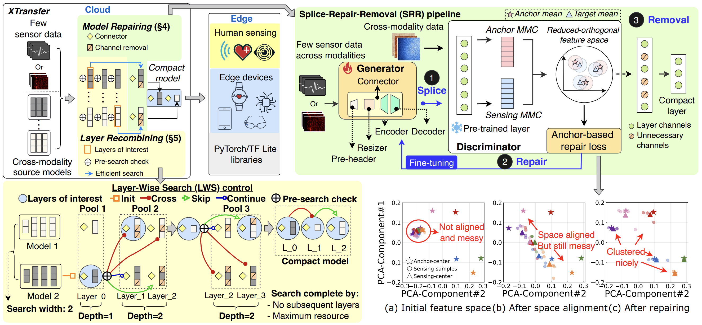

<div align="center">   

# XTransfer: Modality-Agnostic Few-Shot Model Transfer for Human Sensing at the Edge
</div>

<div align="center">   

[](http://arxiv.org/abs/2506.22726) 
[](LICENSE) 
[]()

</div>

This is the official repository of the **XTransfer**, a pioneering and scalable method that enables modality-agnostic few-shot model transfer for advancing human sensing on edge systems. (under review). 

**XTransfer: Modality-Agnostic Few-Shot Model Transfer for Human Sensing at the Edge**
<br/>
[Yu Zhang<sup>1</sup>](https://yuzhang.dev/), [Xi Zhang<sup>1</sup>](), [Hualin Zhou<sup>1</sup>](), [Xinyuan Chen<sup>1</sup>](), [Shang Gao<sup>1</sup>](), [Hong Jia<sup>3</sup>](https://h-jia.github.io/), [Jianfei Yang<sup>2</sup>](https://marsyang.site/), [Yuankai Qi<sup>1</sup>](https://v3alab.github.io/author/yuankai-qi/), [Tao Gu<sup>1</sup>](https://taogu.site/)
<br/>
<br/>
<sup>1</sup>Macquarie University, <sup>2</sup>Nanyang Technological University, <sup>3</sup>The University of Melbourne
<br/>


## 🔥 News
- [2025-06-28] Our preprint paper is available on 👉[arXiv](http://arxiv.org/abs/2506.22726).
  

## 🔗 Citation
If you find our work helpful to your research, please consider citing:


```shell
@article{Yu_2025,
  title={XTransfer: Cross-Modality Model Transfer for Human Sensing with Few Data at the Edge},
  author={Yu Zhang and Xi Zhang and Hualin Zhou and Xinyuan Chen and Shang Gao and Hong Jia and Jianfei Yang and Yuankai Qi and Tao Gu},
  eprint={2506.22726},
  archivePrefix={arXiv},
  year={2025}
}
```
## 📝 Abstract 

Deep learning for human sensing on edge systems presents significant potential for smart applications. However, its training and development are hindered by the limited availability of sensor data and resource constraints of edge systems. While transferring pre-trained models to different sensing applications is promising, existing methods often require extensive sensor data and computational resources, resulting in high costs and poor adaptability in practice. In this paper, we propose XTransfer, a first-of-its-kind method enabling modality-agnostic, few-shot model transfer with resource-efficient design. XTransfer flexibly uses single or multiple pre-trained models and transfers knowledge across different modalities by (i) model repairing that safely mitigates modality shift by adapting pre-trained layers with only few sensor data, and (ii) layer recombining that efficiently searches and recombines layers of interest from source models in a layer-wise manner to create compact models. We benchmark various baselines across diverse human sensing datasets spanning different modalities. Comprehensive results demonstrate that XTransfer achieves state-of-the-art performance while significantly reducing the costs of sensor data collection, model training, and edge deployment.

## 📦 Method
|  | 
|:--:| 
| <div align="left">***Figure 1. Overview**. XTransfer transfers source models across modalities with few sensor data through model repairing (SRR pipeline) and layer recombining (LWS control). LWS control first segments source models into layers and operates layer-wise search across pools. At each pool, the pre-search check decides which layers need repairing, then SRR pipeline repairs them and LWS control selects layers of interest. These layers are incrementally recombined during the search, resulting in a compact model for enabling human sensing at the edge. Subfigures (a)–(c) illustrate the feature space evolution before and after repairing.*</div> |


