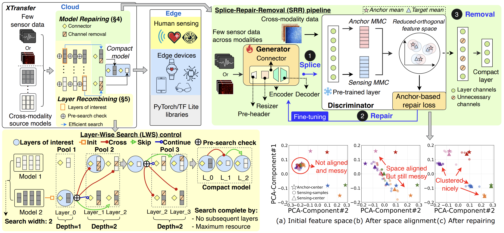

<div align="center">   

# XTransfer: Modality-Agnostic Few-Shot Model Transfer for Human Sensing at the Edge
</div>

<div align="center">   

[](http://arxiv.org/abs/2506.22726) 
[](LICENSE)
[]()
[](https://icml.cc/virtual/2026/poster/63984)

</div>

This is the official repository of the **XTransfer**, a pioneering and scalable method that enables modality-agnostic few-shot model transfer for advancing human sensing on edge systems. 

**XTransfer: Modality-Agnostic Few-Shot Model Transfer for Human Sensing at the Edge**
<br/>
[Yu Zhang<sup>1</sup>](https://yuzhang.dev/), [Xi Zhang<sup>1</sup>](), [Hualin Zhou<sup>1</sup>](), [Xinyuan Chen<sup>1</sup>](), [Shang Gao<sup>1</sup>](), [Hong Jia<sup>2</sup>](https://h-jia.github.io/), [Jianfei Yang<sup>3</sup>](https://marsyang.site/), [Yuankai Qi<sup>1</sup>](https://v3alab.github.io/author/yuankai-qi/), [Tao Gu<sup>1</sup>](https://taogu.site/)
<br/>
<br/>
<sup>1</sup> Macquarie University, <sup>2</sup> The University of Auckland, <sup>3</sup> Nanyang Technological University
<br/>


## 📝 Abstract 

Deep learning for human sensing on edge systems presents significant potential for smart applications. However, its training and development are hindered by the limited availability of sensor data and resource constraints of edge systems. While transferring pre-trained models to different sensing applications is promising, existing methods often require extensive sensor data and computational resources, resulting in high costs and limited transferability. In this paper, we propose XTransfer, a first-of-its-kind method enabling modality-agnostic, few-shot model transfer with resource-efficient design. XTransfer flexibly uses pre-trained models and transfers knowledge across different modalities by (i) model repairing that safely mitigates modality shift by adapting pre-trained layers with only few sensor data, and (ii) layer recombining that efficiently searches and recombines layers of interest from source models in a layer-wise manner to restructure models. We benchmark various baselines across diverse human sensing datasets spanning different modalities. The results show that XTransfer achieves state-of-the-art performance while significantly reducing the costs of sensor data collection, model training, and edge deployment.


## 📦 Method
|  | 
|:--:| 
| <div align="left">***Figure 1. Overview**. XTransfer transfers source models across modalities with few sensor data through model repairing (SRR pipeline) and layer recombining (LWS control).  LWS control first segments source models into layers and operates layer-wise search across pools. At each pool, the pre-search check decides which layers need repairing, then SRR pipeline repairs them and LWS control selects layers of interest. These layers are incrementally recombined during the search, restructuring models for enabling human sensing at the edge. Subfigures (a)–(c) illustrate the feature space evolution before and after repairing.*</div> |


## 🚀 This Release

This repository provides the XTransfer method implementation — the SRR pipeline
(Splice–Repair–Removal) and the Layer-Wise Search (LWS) control, under
`xtransfer/` — together with a ready-to-run example. The paper evaluates
XTransfer across diverse modalities and human-sensing datasets; this release
includes a public verification setup based on HHAR.

## ⚙️ Requirements

Dependencies are managed with [uv](https://docs.astral.sh/uv/). A CUDA GPU is
recommended (tested on an RTX 4090, CUDA 11.8, PyTorch 2.5.1).

```bash
# install uv if needed:  pip install uv
uv sync          # creates .venv and installs locked dependencies
```

## 📂 Dataset & pre-trained model

The paper includes both public and private datasets. This release provides a
public verification setup based on HHAR, while private datasets are pending to be
released due to privacy and ethics constraints.

Large files are not bundled — download them and place them as below (the repo
ships only the folder skeleton and the few-shot split file):

```
Data/
  Dataset/                      # HHAR raw data, per-user folders a, b, c, ...
pre-trained_weights/
  miniImageNet/
    model.pth.tar              # source ResNet18 pre-trained on miniImageNet
    anchor_activation_mmc.pkl  # pre-computed anchor MMC statistics for SRR
```

Download link (HHAR data + source model + anchor statistics):
[Google Drive](https://drive.google.com/drive/folders/1X4wjwNv7FtLp235Mkg46wNrA4FBfIKCl?usp=sharing)

The HHAR few-shot split (`dataloader/target_loader/filelists/HHAR/hhar.pkl`) is
included. `anchor_activation_mmc.pkl` is a pre-computed artefact used by the
repair stage.

## ▶️ Run

```bash
# source miniImageNet ResNet18 -> target HHAR, 5-shot, fold 1
uv run python run.py --dataset HHAR --shot 5 --fold 1

# full Leave-One-Out cross-validation sweep, reports per-shot mean accuracy
uv run python validate_all.py --dataset HHAR
```

Results (per-layer accuracy, final accuracy, MACs/params) are written to
`output/<run>/log_dict.pkl` and the console.

## 🔧 Configuration

The method's fixed hyper-parameters live in a single file,
[`configs/hhar_single.yaml`](configs/hhar_single.yaml) — read it to know exactly
what a run does. It is merged on top of the schema in
`xtransfer/config/defaults.py`; only per-run knobs (`--dataset`, `--shot`,
`--fold`) are passed on the command line.

## 🗂️ Layout

```
xtransfer/            # the method
  core.py             #   SRR pipeline + LWS control
  trans.py            #   connectors, repair/rotation transforms, fine-tuning
  encoder.py          #   generative transfer module
  model_builder.py    #   source-model loader
  torch_pruning/      #   PCA-based layer channel removal (SRR "Removal")
  config/, paths.py   #   config schema + data/model paths
dataloader/, modeling/, utils/   # supporting code
configs/hhar_single.yaml          # run config
run.py, validate_all.py           # entry points
```


## 🔗 Citation
If you find our work helpful to your research, please consider citing:


```shell
@inproceedings{Yu_2026,
      title={XTransfer: Modality-Agnostic Few-Shot Model Transfer for Human Sensing at the Edge}, 
      author={Yu Zhang and Xi Zhang and Hualin Zhou and Xinyuan Chen and Shang Gao and Hong Jia and Jianfei Yang and Yuankai Qi and Tao Gu},
      booktitle={International Conference on Machine Learning},
      year={2026},
      series={ICML '26},
}
```
